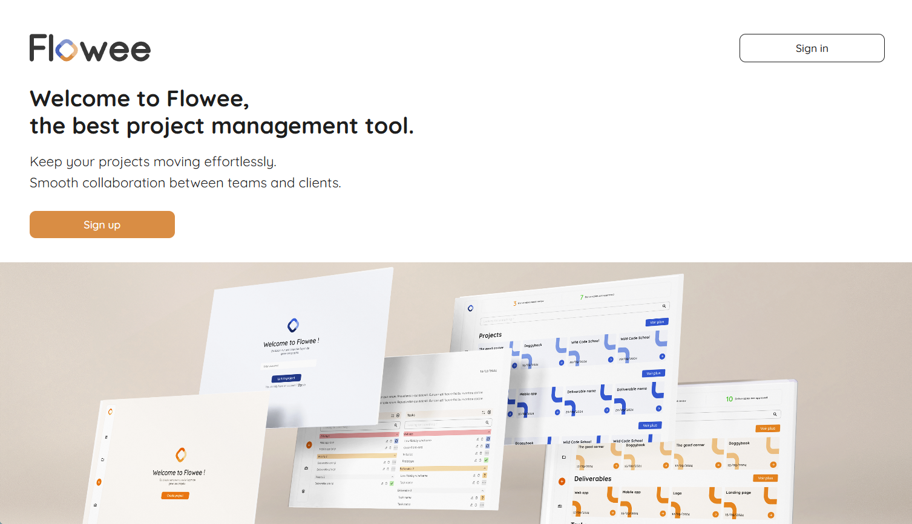

# Flowee "cdajs-2405-projet-flowee"

## La plateforme de gestion de projet qui fluidifie la collaboration entre entreprises et clients


## 📋 Vue d'ensemble

Flowee est une application SaaS conçue pour centraliser et optimiser la gestion de projet entre une entreprise et ses clients. En rassemblant tous les échanges en un seul espace sécurisé, Flowee permet à chaque partie prenante de suivre l'évolution des projets en temps réel et de maintenir une trace de chaque décision de manière claire et optimisée.

## 💻 Aperçu de l'application




## ✨ Fonctionnalités clés

- **Gestion de clients** - Créez, modifiez et archivez des profils clients
- **Gestion de projets** - Suivez l'avancement et gérez les détails de chaque projet
- **Système de livrables** - Organisez les livrables par projet avec validation client
- **Suivi des tâches** - Gestion détaillée des tâches avec assignation et statuts
- **Tableau de bord** - Vue d'ensemble de tous les projets et KPIs essentiels
- **Interface adaptative** - Expérience utilisateur optimisée selon le rôle (admin, entreprise, client)
- **Sécurité intégrée** - Système d'authentification et de protection des données

## 🔧 Stack technique

### Backend
- **Node.js** - Environnement d'exécution JavaScript côté serveur
- **TypeORM** - ORM pour la gestion des entités et des relations
- **TypeGraphQL** - Framework pour créer des APIs GraphQL avec TypeScript
- **Apollo Server** - Serveur GraphQL complet pour Node.js
- **PostgreSQL** - Base de données relationnelle robuste

### Frontend
- **React** - Bibliothèque JavaScript pour construire l'interface utilisateur
- **Apollo Client** - Client GraphQL pour React et la gestion d'état
- **Tailwind CSS** - Framework CSS utilitaire pour un design responsive
- **TypeScript** - Superset JavaScript avec typage statique

## 🚀 Démarrage rapide

### Prérequis
- Node.js (v18 ou supérieur)
- Docker + Docker Compose
- PostgreSQL (via container)
- Redis (via container)
- Make (Linux/macOS, ou WSL sur Windows)


### Installation

1. Clonez le dépôt
```bash
git clone https://github.com/votre-organisation/flowee.git
cd flowee
```
 2. First launch (local - developpement ) 
 ````
 make env
```

This script performs the following steps:

- Stops the running containers and removes the volumes (docker compose down -v)

- Rebuilds the containers (--build)

- Restarts the services (--force-recreate -d)

You get a ready-to-use environment with:

- Backend at http://localhost:4000

- Frontend at http://localhost:5173

- Adminer at http://localhost:8080

- Redis Commander at http://localhost:8881

⚠️ Dependencies are automatically installed via the Dockerfiles.

## 🏗️ Architecture

Flowee est conçu selon une architecture 3-tiers moderne et modulaire :

### 1. Couche de présentation (Frontend)
- Interface utilisateur React avec Tailwind CSS
- Gestion d'état via Apollo Client
- **Architecture Atomic Design** (atomes, molécules, organismes) pour des composants hautement réutilisables
- Expérience adaptée selon les rôles utilisateurs

### 2. Couche métier (Backend)
- API GraphQL avec Apollo Server
- Résolveurs TypeGraphQL pour la logique métier
- Système d'authentification et gestion des permissions
- Validations et transformations des données

### 3. Couche de données (Persistance)
- Base de données PostgreSQL relationnelle
- ORM TypeORM pour la modélisation des entités
- Relations structurées entre clients, projets, livrables et tâches
- Migrations et gestion des schémas automatisées

Cette architecture assure une séparation claire des préoccupations, facilite la maintenance et permet une évolution indépendante de chaque couche.

### Organisation du code
L'application est organisée en deux modules principaux reflétant l'architecture 3-tiers :
- **Frontend** : Interfaces utilisateur et logique de présentation
- **Backend** : API, logique métier et accès aux données


## 🔄 Intégration et déploiement continus

Flowee utilise des workflows GitHub Actions pour automatiser les tests et le déploiement :

### Tests automatisés
- ✅ **Tests unitaires** : Exécution automatique des tests Jest à chaque push et pull request
- ✅ **Tests d'intégration** : Vérification de la cohérence entre le frontend et l'API
- ✅ **Linting et validation TypeScript** : Contrôle de la qualité du code

### Pipeline de déploiement
- 🔄 **Environnement de développement** : Déploiement automatique à chaque merge sur la branche `dev`
- 🔄 **Environnement de staging** : Déploiement automatique à chaque merge sur la branche `staging` 
- 🚀 **Production** : Déploiement semi-automatisé après validation sur `main`

Ces automatisations garantissent la stabilité de l'application et permettent des livraisons rapides et fiables.


## 📄 Licence

Ce projet est sous licence [MIT](LICENSE).

## 💡 À propos

Flowee est né d'un besoin réel rencontré par les développeurs freelance et les entreprises souhaitant structurer efficacement leur collaboration client. Notre mission est de simplifier la gestion de projet tout en garantissant transparence et traçabilité pour toutes les parties impliquées.

---

Développé avec ❤️ par l'équipe Flowee
